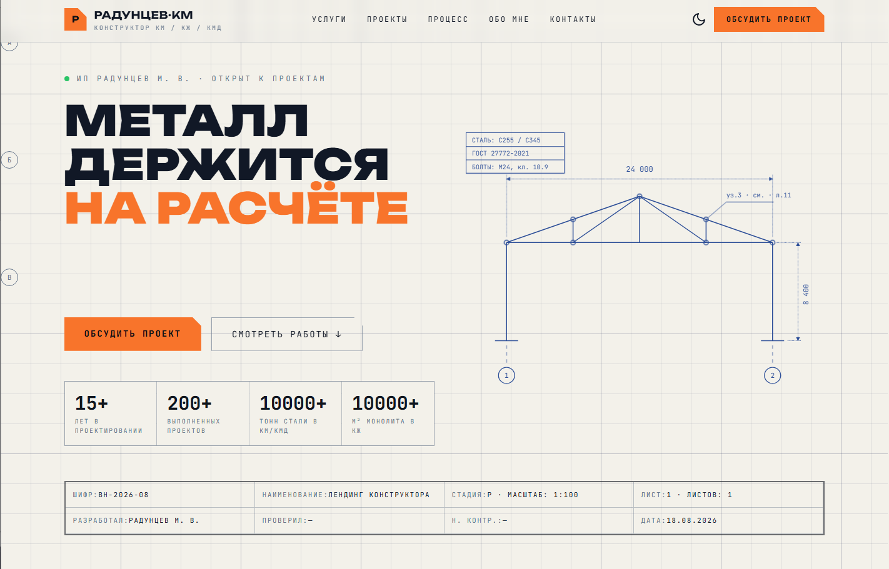
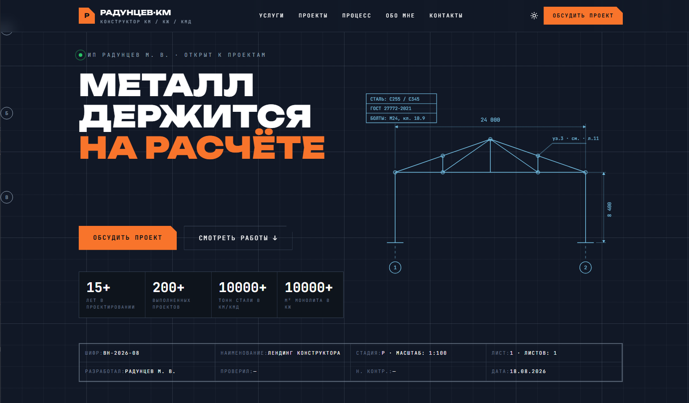

# Персональный сайт-портфолио

<picture>
    <source media="(prefers-color-scheme: dark)" srcset="https://shieldcn.dev/badge/Rust-000000.svg?logo=rust&logoColor=fff&mode=dark">
    
</picture>
<picture>
    <source media="(prefers-color-scheme: dark)" srcset="https://shieldcn.dev/badge/Structural_Engineer-000000.svg?logo=blueprint&logoColor=fff&variant=branded&mode=dark">
    
</picture>
<picture>
    <source media="(prefers-color-scheme: dark)" srcset="https://shieldcn.dev/badge/BIM_CAD-000000.svg?logo=autodesk&logoColor=fff&variant=branded&mode=dark">
    
</picture>
<picture>
    <source media="(prefers-color-scheme: dark)" srcset="https://shieldcn.dev/badge/Calculations-000000.svg?logo=mathworks&logoColor=fff&variant=branded&mode=dark">
    
</picture>
<picture>
    <source media="(prefers-color-scheme: dark)" srcset="https://shieldcn.dev/badge/Supervision-000000.svg?logo=checkmarx&logoColor=fff&variant=branded&mode=dark">
    
</picture>

Персональный сайт-портфолио инженера-конструктора КМ/КЖ/КМД. Проект выполнен на **Leptos** (Rust + WASM) с использованием **Tailwind CSS** и следует принципам модульной архитектуры: данные отделены от представления, UI-примитивы переиспользуемы, логика вынесена в хуки.

